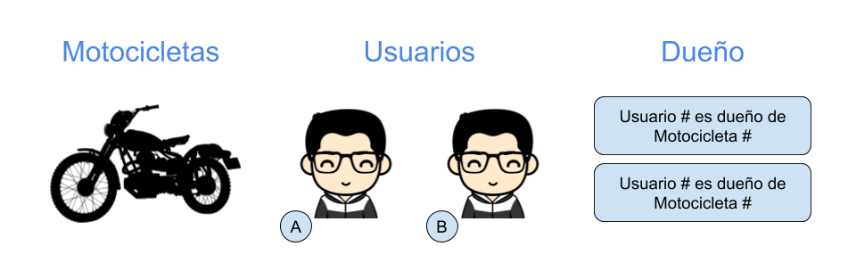
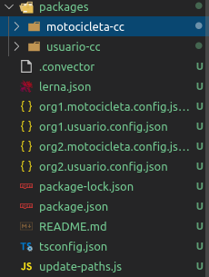

# Convector: Smart Contracts
## Guia:
### Instalación
Instalar `CLI` convector
 ```bash
 npm i -g @worldsibu/convector-cli
 ```
 Instalar `REST SERVER` convector (BETA 16-Agosto-2019)

 ```bash
 npm install -g @worldsibu/conv-rest-api
 ```

 Instalamos `Hurley`, que es el que instala automaticamente ambiente de desarrollo Hyperledger
 ```bash
 npm i -g @worldsibu/hurley
 ```
Ahora procedemos a crear nuestro proyecto en el directorio deseado usando los siguentes  comandos
```bash
conv new <NOMBRE-DEL-PROYECTO> -c <NOMBRE-DEL-PRIMER-CHAINCODE>
cd motor
npm install
```
Esto creo en modelo en base al `chaincode` ingresado.
Ahora bien, como se realizara la prueba usando usuarios con otro chaincode, la motocicleta.
(Ver diseño de la red acontinuación)



Añadiremos un nuevo `chaincode` que manejara a los usuarios (organizaciones)
```bash
conv generate chaincode usuario
```
Dando como resultado estos nuevos archivos en la carpete `./packages`



Ahora bien, dado que el `controller` de la motocicleta tendra logica proveninete de los usuarios, se necesita incluir el paquete `usuario-cc` a las dependencias del paquete `motocicleta-cc`.
```bash
npx lerna add usuario-cc --scope motocicleta-cc --include-filtered-dependencies
```

### Modelo
Se puede generar un `Model` dentro del chaincode usando el siguente comando:
```bash
conv generate -c <NOMBRE-DEL-CHAINCODE> model <NOMBRE-DEL-MODELO>
```